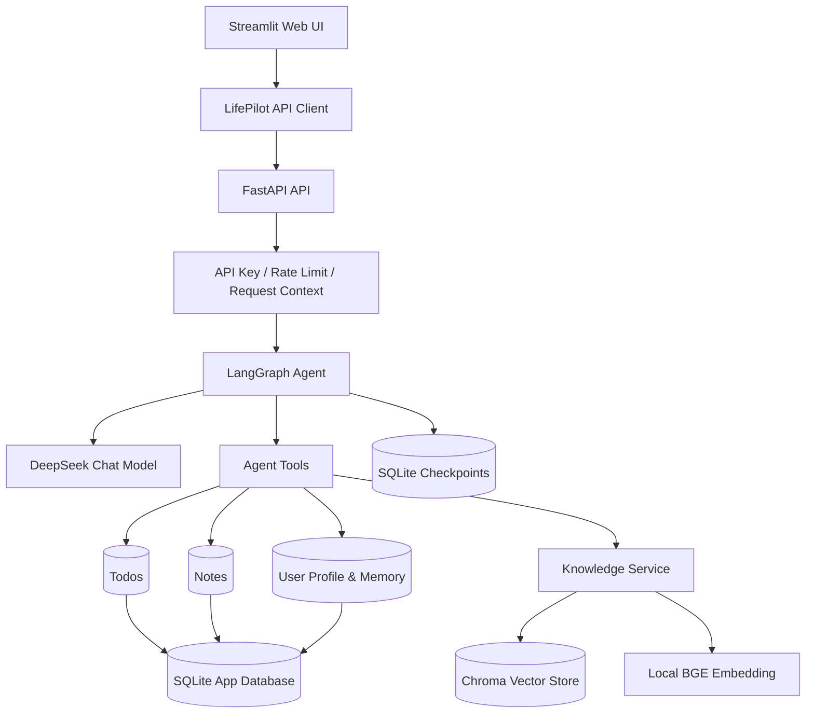
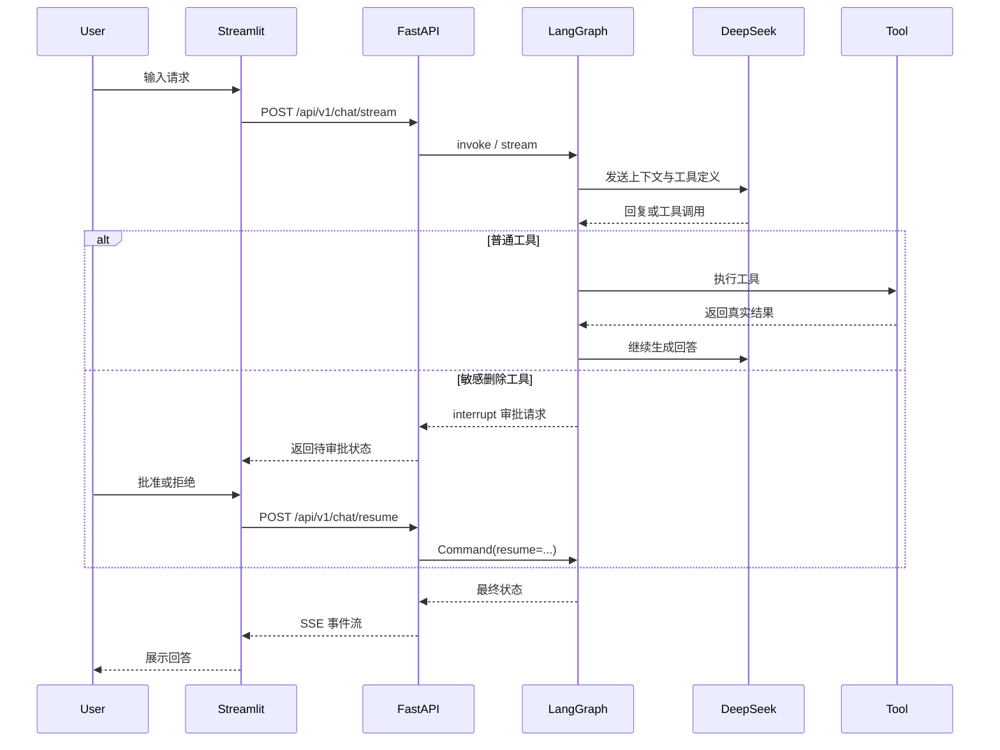

# LifePilot Agent

[](https://github.com/AFPyannian/lifepilot-agent/actions/workflows/quality.yml)

一个面向个人本地使用的中文生活管理 Agent。项目基于 LangGraph、FastAPI、Streamlit、DeepSeek 和 RAG 构建，支持多轮会话、待办与笔记管理、长期记忆、个人知识库、流式响应，以及敏感删除操作的人工审批。

该仓库不仅展示 Agent 功能，也完整覆盖状态持久化、错误处理、可观测性、安全边界、自动化测试和代码质量工程。

## 核心能力

| 能力 | 实现 |
| --- | --- |
| Agent 编排 | LangGraph 状态图驱动模型与工具循环 |
| 工具调用 | 待办、笔记、用户资料、长期记忆和知识库工具 |
| 人工审批 | 删除类敏感操作通过 interrupt/resume 暂停并恢复 |
| 短期记忆 | LangGraph SQLite Checkpointer 按会话保存状态 |
| 长期记忆 | SQLite 按 owner ID 隔离用户资料与记忆 |
| RAG | 本地 BGE 中文 Embedding、Chroma 和文档召回 |
| API | FastAPI、SSE 流式响应、会话及知识库管理接口 |
| Web 界面 | Streamlit 聊天、会话、知识库和审批交互 |
| 安全 | API Key、滑动窗口限流、敏感信息脱敏和安全响应头 |
| 可观测性 | 结构化日志、Request ID、可选 LangSmith 追踪 |
| 工程质量 | pytest、branch coverage、Ruff、mypy、pre-commit 和 CI |

## 系统架构



一次典型请求的执行流程：



更多说明见 [系统架构](docs/architecture.md) 和 [关键设计决策](docs/design-decisions.md)。

## 技术栈

- Python 3.11
- LangGraph / LangChain
- DeepSeek Chat Model
- FastAPI / Uvicorn
- Streamlit
- SQLite / LangGraph SQLite Checkpointer
- Chroma / BGE Small ZH v1.5
- Pydantic Settings
- pytest / pytest-cov
- Ruff / mypy / pre-commit
- GitHub Actions

## 项目结构

```text
lifepilot-agent/
├── app/
│   ├── api/                 # FastAPI 路由、中间件、认证和流式响应
│   ├── clients/             # Streamlit 使用的后端 API 客户端
│   ├── knowledge/           # 文档加载、向量存储和知识库服务
│   ├── repositories/        # SQLite 数据访问层
│   ├── tools/               # Agent 工具
│   ├── graph.py             # LangGraph 状态与执行图
│   ├── config.py            # 集中配置和校验
│   └── main.py              # 命令行入口
├── frontend/                # Streamlit Web 界面
├── evaluations/             # Agent 与 RAG 评估数据及脚本
├── tests/                   # 单元测试和集成测试
├── scripts/                 # 本地质量检查脚本
├── docs/                    # 架构、配置、测试和设计文档
└── .github/workflows/       # GitHub Actions CI
```

## 快速开始

### 1. 克隆并创建虚拟环境

```powershell
git clone https://github.com/AFPyannian/lifepilot-agent.git
Set-Location lifepilot-agent
py -3.11 -m venv .venv
.\.venv\Scripts\Activate.ps1
```

如果 PowerShell 阻止激活脚本，可仅对当前进程调整策略：

```powershell
Set-ExecutionPolicy -Scope Process -ExecutionPolicy Bypass
.\.venv\Scripts\Activate.ps1
```

### 2. 安装依赖

```powershell
python -m pip install --upgrade pip
python -m pip install -r requirements.txt
```

### 3. 下载本地 Embedding 模型

知识库默认使用 `BAAI/bge-small-zh-v1.5`，保存到不会提交 Git 的 `models/` 目录：

```powershell
python -c "from huggingface_hub import snapshot_download; snapshot_download(repo_id='BAAI/bge-small-zh-v1.5', local_dir='models/bge-small-zh-v1.5')"
```

如果暂时不使用知识库，也建议准备该模型，因为后端启动时会初始化知识库服务。

### 4. 创建本地配置

```powershell
Copy-Item .env.example .env
```

至少填写 DeepSeek Key：

```env
DEEPSEEK_API_KEY=your-deepseek-api-key
```

如需保护本地业务接口，可生成共享 API Key：

```powershell
python -c "import secrets; print(secrets.token_urlsafe(32))"
```

然后配置：

```env
API_AUTH_ENABLED=true
LIFEPILOT_API_KEY=生成的随机字符串
```

Streamlit 与后端读取同一个 `.env`，因此会自动携带该密钥。完整配置见 [配置说明](docs/configuration.md)。

### 5. 启动后端

```powershell
python -m uvicorn app.api.server:app --host 127.0.0.1 --port 8000
```

可访问：

- 健康检查：<http://127.0.0.1:8000/api/v1/health>
- 就绪检查：<http://127.0.0.1:8000/api/v1/ready>
- Swagger UI：<http://127.0.0.1:8000/docs>

### 6. 启动 Web 界面

在另一个已激活虚拟环境的 PowerShell 窗口中运行：

```powershell
streamlit run frontend/streamlit_app.py
```

### 7. 可选：使用命令行界面

```powershell
python -m app.main
```

## 数据与隐私

本项目默认在本地保存运行数据：

```text
data/lifepilot.db       # 待办、笔记、会话、用户资料和长期记忆
data/checkpoints.db     # LangGraph 会话执行状态
data/chroma/            # 知识库向量索引
knowledge_base/         # 本地知识文档
logs/lifepilot.log      # 应用日志
```

这些目录和文件默认不会提交到 Git。公开仓库前仍应确认 `.env`、数据库、日志、模型文件和私人知识文档没有进入 Git 历史。

## 测试与质量检查

安装开发依赖：

```powershell
python -m pip install -r requirements-dev.txt
```

运行统一质量检查：

```powershell
.\scripts\quality.ps1
```

该脚本依次执行：

1. Ruff lint
2. Ruff format check
3. mypy
4. pytest 与分支覆盖率检查

也可以分别运行：

```powershell
python -m ruff check .
python -m ruff format --check .
python -m mypy app
python -m pytest --cov=app --cov-branch --cov-report=term-missing
```

安装 Git hooks：

```powershell
pre-commit install --install-hooks
pre-commit install --hook-type pre-push
pre-commit run --all-files
```

详细测试策略见 [测试文档](docs/testing.md)。

## Agent 与 RAG 评估

RAG 召回评估使用本地模型，不调用聊天模型：

```powershell
python -m evaluations.run_rag_eval
```

Agent 评估会调用真实模型，可能产生费用：

```powershell
python -m evaluations.run_agent_eval
```

只运行指定 Agent 用例：

```powershell
python -m evaluations.run_agent_eval --case add_todo
```

评估报告写入被 Git 忽略的 `evaluation_reports/`。

## API 安全边界

- `/api/v1/health`、`/api/v1/ready` 和 `/docs` 保持公开。
- 聊天、知识库和会话管理接口可通过 `X-API-Key` 保护。
- 内存限流器按 API Key 摘要或客户端 IP 计数。
- API Key 只适合受信任的本地或 HTTPS 环境。
- 当前限流状态不跨进程共享，服务重启后会清空。

## 项目定位与限制

LifePilot Agent 是面向个人本地使用的工程化作品，不是多租户 SaaS。当前版本有意保持以下边界：

- 使用 SQLite 和本地 Chroma，不支持多实例共享状态。
- 使用单个共享 API Key，不提供用户注册、OAuth 或角色权限。
- 限流器位于进程内，不适用于分布式部署。
- 知识库文件和长期记忆由本地使用者自行管理及备份。
- CI 只运行离线自动化测试，不调用真实 DeepSeek API。

这些取舍及后续扩展方向见 [关键设计决策](docs/design-decisions.md)。

## 版本

当前版本：`v1.0.0`

版本变化见 [CHANGELOG.md](CHANGELOG.md)。

## License

本项目使用 [MIT License](LICENSE)。
