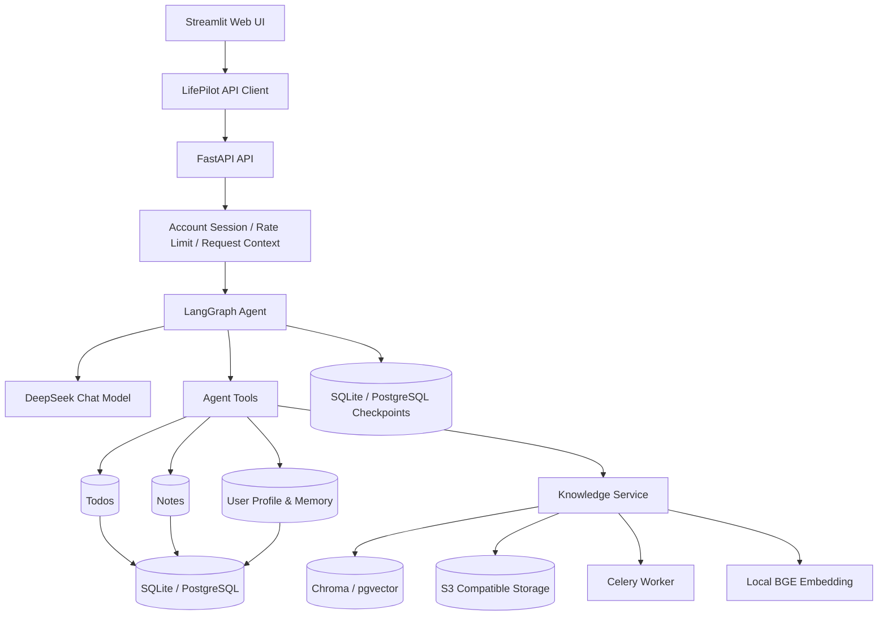
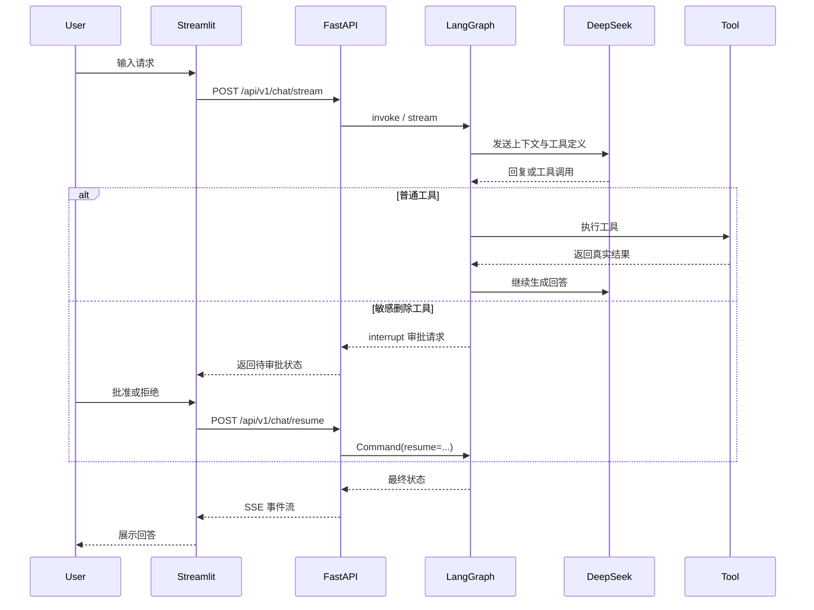

# LifePilot Agent

[](https://github.com/AFPyannian/lifepilot-agent/actions/workflows/quality.yml)

一个支持多账号和生产化部署的中文生活管理 Agent。项目基于 LangGraph、FastAPI、Streamlit、DeepSeek 和 RAG 构建，支持多轮会话、待办与笔记管理、长期记忆、个人知识库、流式响应，以及敏感删除操作的人工审批。

该仓库不仅展示 Agent 功能，也完整覆盖状态持久化、错误处理、可观测性、安全边界、自动化测试和代码质量工程。

## 核心能力

| 能力 | 实现 |
| --- | --- |
| Agent 编排 | LangGraph 状态图驱动模型与工具循环 |
| 工具调用 | 待办、笔记、用户资料、长期记忆和知识库工具 |
| 人工审批 | 删除类敏感操作通过 interrupt/resume 暂停并恢复 |
| 短期记忆 | 本地 SQLite 或生产 PostgresSaver 按用户会话保存状态 |
| 账号与隔离 | Argon2id 密码、可撤销 Session、用户状态和端到端数据隔离 |
| 长期记忆 | SQLite 或 PostgreSQL 按登录用户 UUID 隔离资料与记忆 |
| RAG | 本地 Chroma，或 S3 + Celery + pgvector 生产知识链路 |
| API | FastAPI、SSE 流式响应、会话及知识库管理接口 |
| Web 界面 | Streamlit 聊天、会话、知识库和审批交互 |
| 安全 | Bearer Session、登录防爆破、审计日志、限流和安全响应头 |
| 能力授权 | AccessPolicy 集中判断账号、BYOK 与平台模型权限 |
| 模型用量 | 按真实模型调用记录模式、结果、耗时与 Token，不保存消息正文 |
| 生产并发 | Redis 共享限流、PostgreSQL 会话锁、后台向量化和运营后台 |
| 可观测性 | 结构化日志、Request ID、可选 LangSmith 追踪 |
| 工程质量 | pytest、branch coverage、Ruff、mypy、pre-commit 和 CI |

## 系统架构



一次典型请求的执行流程：



更多说明见 [系统架构](docs/architecture.md)、[关键设计决策](docs/design-decisions.md)和[生产部署](docs/production-deployment.md)。

## 技术栈

- Python 3.11
- LangGraph / LangChain
- DeepSeek Chat Model
- FastAPI / Uvicorn
- Streamlit
- SQLite / PostgreSQL / LangGraph PostgresSaver
- Chroma / pgvector / BGE Small ZH v1.5
- Redis / Celery / S3 兼容对象存储
- Pydantic Settings
- pytest / pytest-cov
- Ruff / mypy / pre-commit
- GitHub Actions

## 项目结构

```text
lifepilot-agent/
├── app/
│   ├── api/                 # FastAPI 路由、中间件、认证和流式响应
│   ├── access/              # 能力、授权记录与集中访问策略
│   ├── auth/                # 密码哈希、Session 服务和登录限流
│   ├── clients/             # Streamlit 使用的后端 API 客户端
│   ├── credentials/         # 用户模型凭据加密与生命周期管理
│   ├── domain/              # 与数据库实现无关的共享领域模型
│   ├── infrastructure/      # local/production 仓储装配工厂
│   ├── knowledge/           # 文档加载、向量存储和知识库服务
│   ├── repositories/        # 共享协议及 SQLite/PostgreSQL 适配器
│   ├── storage/             # S3 兼容对象存储
│   ├── tasks/               # Celery 后台任务
│   ├── tools/               # Agent 工具
│   ├── usage/               # 模型调用上下文与用量追踪
│   ├── graph.py             # LangGraph 状态与执行图
│   ├── config.py            # 集中配置和校验
│   └── main.py              # 命令行入口
├── frontend/                # Streamlit Web 界面
├── evaluations/             # Agent 与 RAG 评估数据及脚本
├── tests/                   # 单元测试和集成测试
├── scripts/                 # 本地质量检查脚本
├── migrations/              # Alembic PostgreSQL 迁移
├── docs/                    # 架构、配置、测试和设计文档
└── .github/workflows/       # GitHub Actions CI
```

## 快速开始

### 1. 克隆并创建虚拟环境

```powershell
git clone https://github.com/AFPyannian/lifepilot-agent.git
Set-Location lifepilot-agent
py -3.11 -m venv .venv
.\.venv\Scripts\Activate.ps1
```

如果 PowerShell 阻止激活脚本，可仅对当前进程调整策略：

```powershell
Set-ExecutionPolicy -Scope Process -ExecutionPolicy Bypass
.\.venv\Scripts\Activate.ps1
```

### 2. 安装依赖

```powershell
python -m pip install --upgrade pip
python -m pip install -r requirements.txt
```

### 3. 下载本地 Embedding 模型

知识库默认使用 `BAAI/bge-small-zh-v1.5`，保存到不会提交 Git 的 `models/` 目录：

```powershell
python -c "from huggingface_hub import snapshot_download; snapshot_download(repo_id='BAAI/bge-small-zh-v1.5', local_dir='models/bge-small-zh-v1.5')"
```

如果暂时不使用知识库，也建议准备该模型，因为后端启动时会初始化知识库服务。

### 4. 创建本地配置

```powershell
Copy-Item .env.example .env
```

至少填写 DeepSeek Key：

```env
DEEPSEEK_API_KEY=your-deepseek-api-key
```

如需允许登录用户使用自己的 DeepSeek Key，另行生成32字节主密钥并配置：

```env
BYOK_ENABLED=true
PROVIDER_CREDENTIAL_MASTER_KEYS={"v1":"URL-safe-Base64主密钥"}
PROVIDER_CREDENTIAL_ACTIVE_KEY_VERSION=v1
```

用户 Key 由后端验证并使用 AES-256-GCM 加密，前端只能查看末四位掩码。完整配置和
主密钥轮换流程见 [配置说明](docs/configuration.md)。

业务接口始终要求账号 Session。首次启动前创建管理员账号，密码会在终端中隐藏输入：

```powershell
python -m scripts.user_admin create --username admin --role admin
```

项目默认关闭注册。管理员账号创建完成后，可在 `.env` 中启用一次性邀请码注册：

```env
REGISTRATION_MODE=invite
```

重启后端后，管理员可以在 Streamlit 的“注册邀请”面板生成邀请码；新用户在登录页的“注册”标签中自行设置用户名和密码。邀请码只可使用一次，原文只向管理员展示一次。

CLI 仍可用于直接创建用户、禁用账号或重置密码：

```powershell
python -m scripts.user_admin create --username alice --role user
python -m scripts.user_admin status --username alice --status disabled
python -m scripts.user_admin reset-password --username alice
```

平台模型权限独立于账号状态。升级前已经存在的启用账号会通过一次性迁移保留平台模型权限；之后注册的账号需要管理员显式授权，或配置自己的 DeepSeek Key：

```powershell
python -m scripts.entitlement_admin list --username alice
python -m scripts.entitlement_admin grant --username alice --granted-by admin --capability model.platform
python -m scripts.entitlement_admin revoke --entitlement-id <授权ID>
```

Web 侧“模型用量”展示当前月成功、失败调用和 Token 汇总。原始事件也可通过 `GET /api/v1/usage/events` 查询，接口始终按当前 Session 用户隔离。

Streamlit 登录后只在当前浏览器 Session 中保存访问令牌。完整配置见 [配置说明](docs/configuration.md)。

从 `v1.0.0` 升级且需要保留原 `local-user` 数据时，请先停止后端、创建目标账号，再运行离线迁移。脚本会先备份数据库、知识文件和 Chroma：

```powershell
python -m scripts.migrate_local_user --username admin --confirm
```

单机开发默认继续使用 SQLite、Chroma 和本地文件。切换 `INFRASTRUCTURE_MODE=production` 前，按[阶段四生产部署](docs/production-deployment.md)准备 PostgreSQL、Redis、对象存储和 Celery Worker，并执行 Alembic 与 Checkpoint 初始化。

### 5. 启动后端

```powershell
python -m uvicorn app.api.server:app --host 127.0.0.1 --port 8000
```

可访问：

- 健康检查：<http://127.0.0.1:8000/api/v1/health>
- 就绪检查：<http://127.0.0.1:8000/api/v1/ready>
- Swagger UI：<http://127.0.0.1:8000/docs>

### 6. 启动 Web 界面

在另一个已激活虚拟环境的 PowerShell 窗口中运行：

```powershell
streamlit run frontend/streamlit_app.py
```

### 7. 可选：使用命令行界面

```powershell
python -m app.main
```

## 数据与隐私

本项目默认在本地保存运行数据：

```text
data/lifepilot.db       # 账号、Session、审计事件及全部业务数据
data/checkpoints.db     # LangGraph 会话执行状态
data/chroma/            # 知识库向量索引
knowledge_base/<用户UUID>/ # 按用户隔离的本地知识文档
logs/lifepilot.log      # 应用日志
```

`lifepilot.db` 中的用户模型 Key 只有密文；解密主密钥必须在数据库之外单独备份。

这些目录和文件默认不会提交到 Git。公开仓库前仍应确认 `.env`、数据库、日志、模型文件和私人知识文档没有进入 Git 历史。

## 测试与质量检查

安装开发依赖：

```powershell
python -m pip install -r requirements-dev.txt
```

运行统一质量检查：

```powershell
.\scripts\quality.ps1
```

该脚本依次执行：

1. Ruff lint
2. Ruff format check
3. mypy
4. pytest 与分支覆盖率检查

也可以分别运行：

```powershell
python -m ruff check .
python -m ruff format --check .
python -m mypy app
python -m pytest --cov=app --cov-branch --cov-report=term-missing
```

安装 Git hooks：

```powershell
pre-commit install --install-hooks
pre-commit install --hook-type pre-push
pre-commit run --all-files
```

详细测试策略见 [测试文档](docs/testing.md)。

## Agent 与 RAG 评估

RAG 召回评估使用本地模型，不调用聊天模型：

```powershell
python -m evaluations.run_rag_eval
```

Agent 评估会调用真实模型，可能产生费用：

```powershell
python -m evaluations.run_agent_eval
```

只运行指定 Agent 用例：

```powershell
python -m evaluations.run_agent_eval --case add_todo
```

评估报告写入被 Git 忽略的 `evaluation_reports/`。

## API 安全边界

- `/api/v1/health`、`/api/v1/ready` 和 `/docs` 保持公开。
- `/api/v1/auth/login` 公开，其余账号与业务接口要求 `Authorization: Bearer <session-token>`。
- 密码使用 Argon2id 哈希；数据库只保存 Session 令牌的 SHA-256 摘要。
- 账号禁用、退出全部设备和修改密码会撤销相应 Session。
- 登录失败按客户端 IP 与用户名摘要限流，业务请求按 Session 摘要限流。
- 用户身份只由服务端认证结果注入；待办、笔记、记忆、会话、Checkpoint、知识文件和向量元数据均按用户 UUID 隔离。
- 账号、登录、密码和主要写操作记录审计事件。
- 注册默认关闭；启用后仅接受管理员创建的一次性邀请码。
- 注册用户固定为普通用户，客户端不能指定角色、状态或用户 ID。
- 用户模型 Key 先受控验证后加密保存，API 不提供原文读取或导出。
- 模型网关按认证用户选择 BYOK 或平台 Key，单个用户凭据失效不影响其他用户。
- API 入口和模型网关都通过 AccessPolicy 校验能力，避免绕过界面直接调用。
- 模型调用事件使用唯一事件 ID 幂等写入，不记录消息正文、API Key 或金额。
- 本地模式的限流状态不跨进程共享；生产模式使用 Redis 共享限流。

## 项目定位与限制

LifePilot Agent 同时提供单机开发模式和生产基础设施模式。当前版本仍有意保持以下边界：

- 本地模式使用 SQLite 和 Chroma，仅适合单实例；生产模式才支持多实例共享状态。
- 不提供公开匿名注册、OAuth 或细粒度 RBAC；管理员后台覆盖账号、邀请、授权、审计和用量。
- 当前阶段不实现钱包、余额、账本、支付订单或扣费，平台权限只由授权记录表达。
- 生产部署需要自行运维 PostgreSQL、Redis、对象存储、Celery Worker、HTTPS 和备份。
- Session 是数据库中的不透明令牌；公网部署仍必须使用 HTTPS。
- 本地和生产数据都需要管理员制定备份与恢复策略。
- CI 只运行离线自动化测试，不调用真实 DeepSeek API。

这些取舍及后续扩展方向见 [关键设计决策](docs/design-decisions.md)。

## 版本

最近发布版本：`v1.0.0`；`main` 已进入多账号版本开发。

版本变化见 [CHANGELOG.md](CHANGELOG.md)。

## License

本项目使用 [MIT License](LICENSE)。
