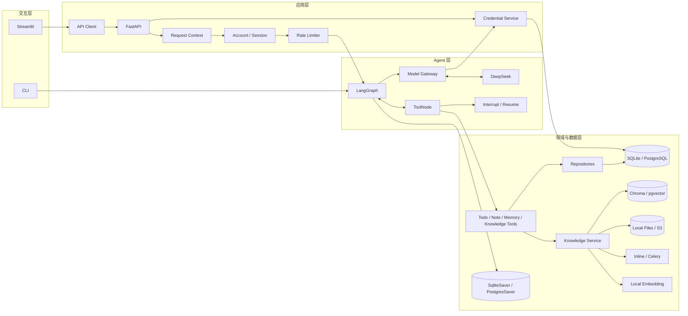
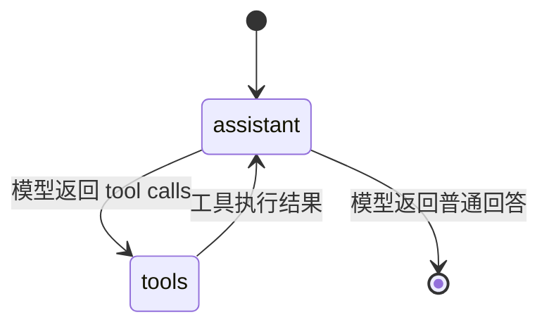
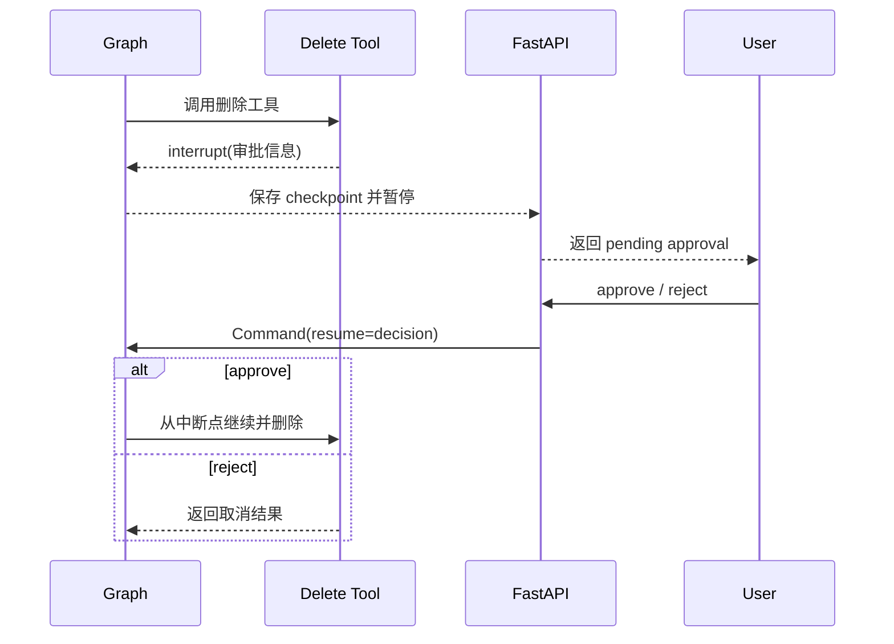
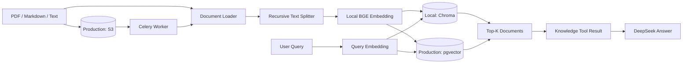

# 系统架构

## 1. 设计目标

LifePilot Agent 同时面向可信本地主机上的快速体验与多实例生产部署。目标是在保留低门槛 local profile 的同时，提供可测试、可恢复、具备明确身份与数据边界的 production profile。系统采用模块化单体架构：Web UI、HTTP API、Agent 编排、工具和数据访问层位于同一仓库，但通过协议、适配器和依赖注入保持职责分离。

## 2. 总体架构

## 3. 模块职责

### 3.1 交互层

`frontend/streamlit_app.py` 提供登录与邀请注册、聊天、会话、知识库、模型凭据、用量、审批和部分运营管理界面。它不直接访问数据库或 Agent，而是统一通过 `LifePilotApiClient` 调用 FastAPI。

`app/main.py` 是仅面向 local profile 的开发入口。CLI 直接使用 SQLite、平台模型和 `LOCAL_CLI_OWNER_ID` 构建 graph，仍复用 Settings、日志、ModelGateway、AccessPolicy 和 Checkpointer；它不提供完整登录、BYOK 或删除审批界面。

### 3.2 API 层

`app/api/server.py` 负责应用生命周期和依赖装配：

1. 加载并校验 Settings。
2. 初始化日志和可选 LangSmith 追踪。
3. 由基础设施工厂选择 SQLite 或 PostgreSQL 仓储适配器。
4. 打开对应的 SqliteSaver 或 PostgresSaver。
5. 初始化账号、Session、审计、会话仓储和知识库服务。
6. 构建 LangGraph。
7. 将依赖保存到 `application.state`。
8. 应用结束时关闭日志和资源。

API 按职责拆分：

| 模块 | 职责 |
| --- | --- |
| `auth_routes.py` | 登录、注册状态、邀请码注册、当前用户、退出和修改密码 |
| `admin_routes.py` | 管理用户、审计、全局用量、配额、能力授权和注册邀请 |
| `routes.py` | 普通聊天、流式聊天、审批恢复 |
| `conversation_routes.py` | 会话列表、详情、重命名和删除 |
| `knowledge_routes.py` | 知识文档上传、列表和删除 |
| `model_routes.py` | 用户模型访问状态及 DeepSeek Key 创建、轮换、撤销和删除 |
| `usage_routes.py` | 当前用户模型用量汇总与事件列表 |
| `health_routes.py` | 公开的存活与就绪检查 |
| `streaming.py` | 将 LangGraph 输出转换成 SSE 事件 |
| `execution.py` | 执行恢复和最终回答提取 |
| `interrupts.py` | 解析和规范化审批中断 |
| `run_config.py` | 统一 thread ID、追踪元数据和递归限制 |

### 3.3 Agent 层

`app/graph.py` 定义一个 assistant/tool 循环：

assistant 节点在每次模型调用前：

1. 读取当前认证用户的长期记忆上下文。
2. 清理中断产生的不完整工具调用序列。
3. 注入系统规则与长期记忆。
4. 将认证用户 UUID、模型模式和消息交给 ModelGateway。

ModelGateway 每次调用都重新解析凭据。`PLATFORM` 使用服务端 SecretStr，`BYOK`
只解密当前认证用户的有效凭据；用户模型实例不会跨请求缓存。LangGraph 状态只保存
`BYOK/PLATFORM` 模式，不保存 API Key，因此审批中断恢复可以沿用原模式，同时不会
把 Secret 写入 Checkpoint。

在进入 Agent 和实际调用模型前，AccessPolicy 分别执行入口校验与网关二次校验。
平台模式要求有效 `model.platform` 授权；BYOK 模式要求实例开关和当前用户的有效凭据。
每次实际模型调用都会先预占月请求配额、创建独立 usage event，并在成功或失败后
完成状态流转；成功响应返回 Token 元数据时再结算 Token 配额。

ToolNode 执行模型选择的工具，并将 ToolMessage 返回给 assistant。数据库结果和工具错误都会转换成明确的工具输出，模型不能自行声称某个操作已经成功。

### 3.4 工具与数据访问

工具层只处理 Agent 可调用的业务动作，Repository 负责 SQL 和数据对象转换。

| 工具组 | 主要能力 | 数据位置 |
| --- | --- | --- |
| Todo | 新增、列表、完成、删除 | SQLite / PostgreSQL |
| Note | 新增、列表、详情、搜索、更新、删除 | SQLite / PostgreSQL |
| Memory | 用户资料、长期事实、查询和遗忘 | SQLite / PostgreSQL |
| Knowledge | 导入、检索、列表、删除文档 | 本地文件 + Chroma / S3 + pgvector |

所有业务数据按认证用户 UUID（数据库字段名为 `owner_id`）隔离。身份由 API 认证依赖写入 LangGraph context 和工具的受信任运行配置，模型可见参数中不存在 `owner_id`，因此模型或客户端不能切换数据作用域。

## 4. 状态与持久化

系统将不同类型的数据分开保存：

| 状态 | 存储 | 作用域 |
| --- | --- | --- |
| 业务数据 | SQLite `data/lifepilot.db` / PostgreSQL | 用户 UUID 与业务主键 |
| LangGraph 消息与执行位置 | SQLite `data/checkpoints.db` / PostgresSaver | 用户 UUID + 公开 thread ID |
| 知识源文件 | `knowledge_base/<用户UUID>/` / S3 | 用户 UUID + 文件名 |
| 向量索引 | Chroma `data/chroma/` / pgvector | 用户 UUID + source |

Checkpoint 使进程重启后仍能恢复会话状态。对外 thread ID 进入 Checkpointer 前会转换为 `user:<UUID>:thread:<thread ID>`，避免两个用户选择相同 thread ID 时读取彼此状态；会话仓储同时以用户 UUID 和公开 thread ID 查询。

## 5. 人工审批流程

删除待办、笔记、长期记忆或知识文档属于不可逆操作。相关工具在真正删除前触发 LangGraph interrupt：

审批状态保存在 Checkpoint 中，不依赖浏览器内存。恢复请求必须使用相同 thread ID。

## 6. RAG 流程

知识库内容被视为参考资料，而不是系统指令。系统提示要求模型忽略文档中试图覆盖规则、泄露密钥或修改权限的内容，并在回答时标明资料来源。

## 7. 安全与稳定性边界

- Pydantic Settings 在启动时校验必填密钥和关联配置。
- 密钥配置使用 SecretStr，配置对象表示不会暴露原始值。
- 密码使用 Argon2id 哈希，登录签发可撤销的不透明 Session；数据库只保存令牌摘要。
- 账号状态在每次认证时校验，禁用账号、修改密码或退出全部设备会撤销 Session。
- 认证后的用户 UUID 由服务端注入所有业务数据访问路径。
- 登录失败按 IP 与用户名摘要限流，业务请求按 Session 摘要限流。
- 账号和主要写操作保存审计事件，不记录原始密码或 Session 令牌。
- 注册默认关闭；邀请模式下，用户创建和邀请码消费位于同一数据库事务，SQLite 使用 `BEGIN IMMEDIATE`，PostgreSQL 对邀请码行加锁。
- 邀请码原文只返回一次，数据库只保存摘要；新用户角色由服务端固定为 `user`。
- 用户 DeepSeek Key 先验证后使用 AES-256-GCM 加密，主密钥不进入数据库。
- 凭据密文通过附加认证数据绑定用户、provider 和记录 ID，不能跨用户调换。
- 凭据接口不提供原文读取；撤销会清除密文、主密钥版本和指纹。
- Request ID 贯穿请求日志和响应。
- DeepSeek 调用有超时和有限重试。
- LangGraph `recursion_limit` 防止异常工具循环无限执行。
- 删除类工具在执行前进行人工审批。

公开的 `/health` 只表示进程存活。`/ready` 在 local profile 检查 Agent graph；在
production profile 还会探测业务 PostgreSQL、Checkpoint PostgreSQL、Redis 和对象存储。

## 8. 并发模型

本地模式使用按用户与会话分片的进程锁，不再以全局 Lock 串行化所有用户。生产模式使用 PostgreSQL 事务级 advisory lock；同一用户会话串行执行，不同用户和不同会话可并发。

生产业务仓储通过 SQLAlchemy 连接池访问 PostgreSQL，LangGraph 使用 PostgresSaver；登录与 API 限流由 Redis 共享。知识源文件进入 S3 兼容对象存储，Celery Worker 异步解析并幂等重建 pgvector 文档块。

应用启动不会自行建业务表。Alembic 管理业务 DDL，LangGraph Checkpoint 表由一次性初始化脚本调用 `setup()` 创建。生产切换与回滚见[生产部署](production-deployment.md)。
