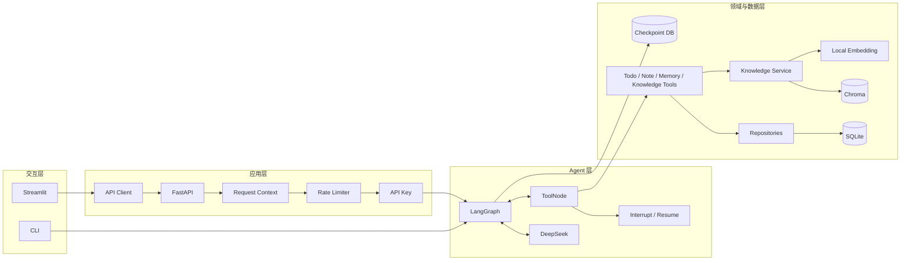
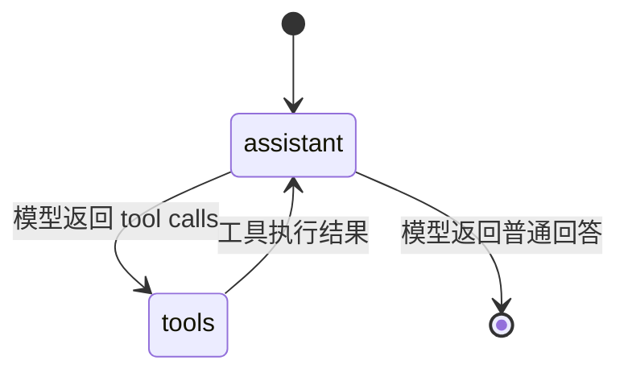
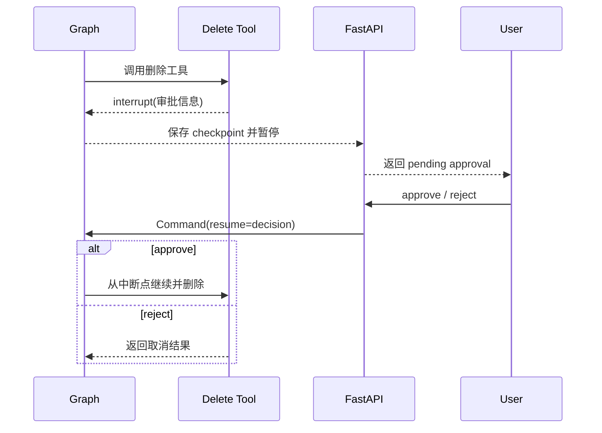
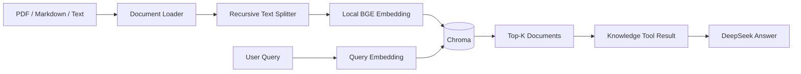

# 系统架构

## 1. 设计目标

LifePilot Agent 面向单个可信用户的本地运行场景，目标是在保持部署简单的同时，展示一个可测试、可恢复、具备明确安全边界的 Agent 应用。系统采用模块化单体架构：Web UI、HTTP API、Agent 编排、工具和数据访问层位于同一仓库，但通过接口和依赖注入保持职责分离。

## 2. 总体架构

## 3. 模块职责

### 3.1 交互层

`frontend/streamlit_app.py` 提供聊天、会话列表、知识库管理和审批交互。它不直接访问数据库或 Agent，而是统一通过 `LifePilotApiClient` 调用 FastAPI。

`app/main.py` 是独立的命令行入口，用于验证 Agent 核心能力。CLI 直接构建 graph，但仍复用相同的 Settings、日志、仓储和 Checkpointer。

### 3.2 API 层

`app/api/server.py` 负责应用生命周期和依赖装配：

1. 加载并校验 Settings。
2. 初始化日志和可选 LangSmith 追踪。
3. 打开 SQLite Checkpointer。
4. 初始化会话仓储和知识库服务。
5. 构建 LangGraph。
6. 将依赖保存到 `application.state`。
7. 应用结束时关闭日志和资源。

API 按职责拆分：

| 模块 | 职责 |
| --- | --- |
| `routes.py` | 普通聊天、流式聊天、审批恢复 |
| `conversation_routes.py` | 会话列表、详情、重命名和删除 |
| `knowledge_routes.py` | 知识文档上传、列表和删除 |
| `health_routes.py` | 公开的存活与就绪检查 |
| `streaming.py` | 将 LangGraph 输出转换成 SSE 事件 |
| `execution.py` | 执行恢复和最终回答提取 |
| `interrupts.py` | 解析和规范化审批中断 |
| `run_config.py` | 统一 thread ID、追踪元数据和递归限制 |

### 3.3 Agent 层

`app/graph.py` 定义一个 assistant/tool 循环：

assistant 节点在每次模型调用前：

1. 读取当前 owner 的长期记忆上下文。
2. 清理中断产生的不完整工具调用序列。
3. 注入系统规则与长期记忆。
4. 调用已经绑定工具的模型。

ToolNode 执行模型选择的工具，并将 ToolMessage 返回给 assistant。数据库结果和工具错误都会转换成明确的工具输出，模型不能自行声称某个操作已经成功。

### 3.4 工具与数据访问

工具层只处理 Agent 可调用的业务动作，Repository 负责 SQL 和数据对象转换。

| 工具组 | 主要能力 | 数据位置 |
| --- | --- | --- |
| Todo | 新增、列表、完成、删除 | SQLite 应用数据库 |
| Note | 新增、列表、详情、搜索、更新、删除 | SQLite 应用数据库 |
| Memory | 用户资料、长期事实、查询和遗忘 | SQLite 应用数据库 |
| Knowledge | 导入、检索、列表、删除文档 | 本地文件和 Chroma |

所有业务数据按 `owner_id` 隔离。当前 UI 面向一个本地用户，但数据层仍保留用户作用域，便于测试隔离和后续扩展。

## 4. 状态与持久化

系统将不同类型的数据分开保存：

| 状态 | 存储 | 作用域 |
| --- | --- | --- |
| LangGraph 消息与执行位置 | `data/checkpoints.db` | thread ID |
| 会话索引和消息记录 | `data/lifepilot.db` | owner ID + thread ID |
| 待办、笔记、用户资料和记忆 | `data/lifepilot.db` | owner ID |
| 知识文档 | `knowledge_base/` | 本地项目实例 |
| 向量索引 | `data/chroma/` | owner ID + source |

Checkpoint 使进程重启后仍能恢复会话状态；会话仓储为 UI 提供独立于 LangGraph 内部状态的列表、标题和消息查询能力。

## 5. 人工审批流程

删除待办、笔记、长期记忆或知识文档属于不可逆操作。相关工具在真正删除前触发 LangGraph interrupt：

审批状态保存在 Checkpoint 中，不依赖浏览器内存。恢复请求必须使用相同 thread ID。

## 6. RAG 流程

知识库内容被视为参考资料，而不是系统指令。系统提示要求模型忽略文档中试图覆盖规则、泄露密钥或修改权限的内容，并在回答时标明资料来源。

## 7. 安全与稳定性边界

- Pydantic Settings 在启动时校验必填密钥和关联配置。
- SecretStr 避免密钥出现在对象表示中。
- 密钥配置使用 SecretStr，配置对象表示不会暴露原始值。
- 可选 `X-API-Key` 保护业务路由。
- 滑动窗口限流按密钥摘要或 IP 计数，不保存原始密钥。
- Request ID 贯穿请求日志和响应。
- DeepSeek 调用有超时和有限重试。
- LangGraph `recursion_limit` 防止异常工具循环无限执行。
- 删除类工具在执行前进行人工审批。

公开的 `/health` 只表示进程存活；`/ready` 还会检查 Agent graph 是否已经初始化。

## 8. 并发模型

应用通过进程内 Lock 保护同一个 graph 实例的关键执行路径。SQLite、Chroma、内存限流器和 Lock 都基于单进程假设，因此当前版本适合个人本地单实例运行，不适合直接扩展为多 Worker 或多实例服务。

如需扩展，应同时处理：

- PostgreSQL 或其他共享数据库。
- Redis Checkpointer 与分布式锁。
- Redis 限流。
- 独立向量数据库。
- 用户身份与授权模型。
- 幂等写操作和跨服务追踪。

这些内容不属于当前个人本地版本的范围。
